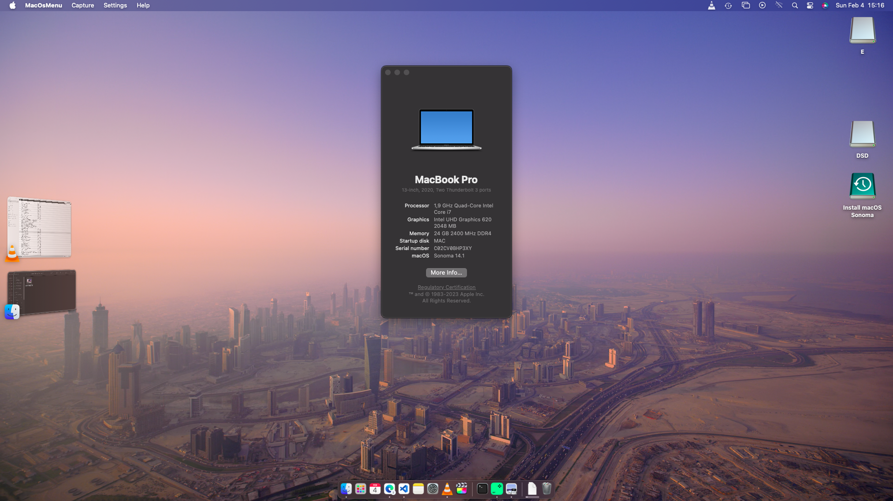

# HP-EliteBook-840-G5 OpenCore
Hackintosh OpenCore EFI files for HP EliteBook 840 G5 Sonoma (Previosuly on Montenery)

## Laptop's Hardware
- <b>Model</b>: HP EliteBook 840 G5
- <b>CPU</b>: Intel® Core™ i5-8650U
- <b>GPU</b>: Intel® UHD Graphics 620
- <b>RAM</b>: 24 GB DDR4 2400MHz (Dual-Channel)
- <b>Wi-Fi</b>: Intel® Dual Band Wireless-AC 8265
- <b>Ethernet</b>: Intel® Ethernet Connection I219-V
- <b>Storage</b>: SAMSUNG SSD PM871b M.2 2280 512GB
- <b>Screen</b>: 1920 x 1080 (1080p FHD - Full High Definition)
- <b>Keyboard</b>: PS2 
- <b>MousePad</b>: Synaptics

# What's Working?
- [x] Intel UHD 620 Graphics
- [x] All USB ports
- [x] Intel Ethernet port
- [x] Audio
- [x] Wi-Fi
- [x] Internal camera
- [x] Trackpad
- [x] Sleep / Wake / Shutdown / Reboot (lid sleep and lid wake)
- [x] Keyboard
- [x] Battery
- [x] HDMI
- [x] USB C Charging
# What's not working ⚠️
- [ ] Mousepad 2 Physical Buttons
- [ ] Bluetooth
- [ ] FingerPrint
# Yet To Test
- DRM Support
- Smart Card
